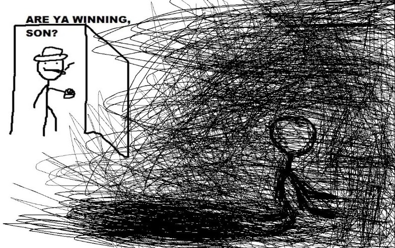
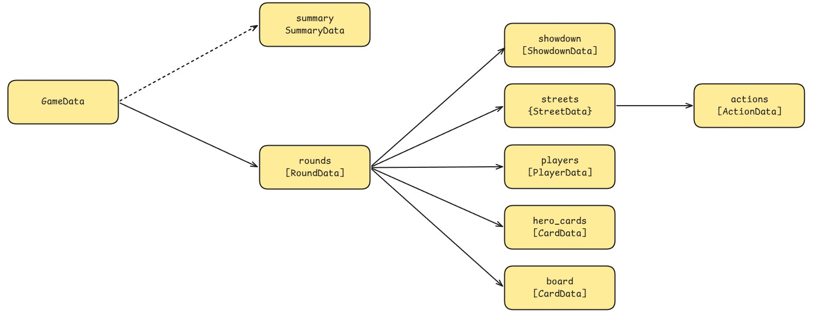

# Are ya Winamaxing, son ?

Simple desktop app tracking your Poker activity on Winamax. Using it might show you how bad you actually are, please use with caution.

> [!WARNING]
> **WORK IN PROGRESS**
> 
> Current state of the app: the whole parsing is done and the debug tool is working. I'm starting building charts.

## Data structure of the parsed hands

This model is a very simplified version, but it shows the global structure of how the different classes interact with each other.

## TODO

- [ ] Adding an enum of positions around the table and find which position the player is
- [ ] Maybe create a better way of tracking players, mostly yourself
